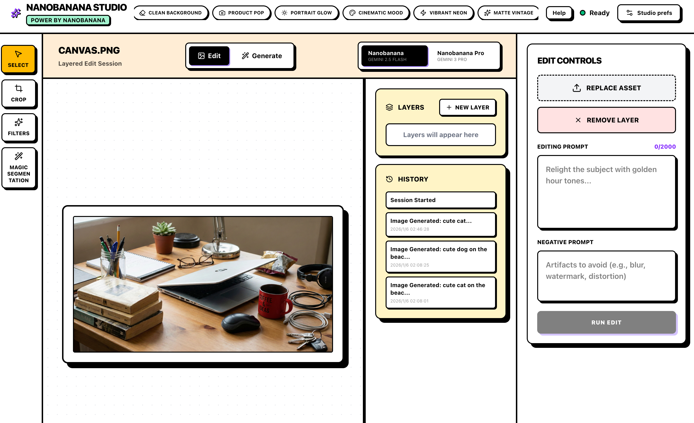

# Banana-Studio

**简体中文** | [English](./README.md)

基于 Next.js 16 构建的现代化 AI 图像编辑器，集成了 Google Gemini 模型和 Meta SAM-2 技术，为您提供流畅、强大的创意体验。



## ✨ 主要功能

- 🎨 **AI 智能编辑**: 通过自然语言指令修改图像（例如：“把天空变成紫色”）。
- ✨ **图像生成**: 使用 Google Gemini 2.5/3.0 从零创作高质量图像素材。
- 🪄 **魔术分割 (Magic Segment)**: 利用 Meta SAM-2 模型瞬间识别并提取对象为独立图层。
- 🖼️ **专业图层系统**: 支持图层显示/隐藏、排序、删除及混合模式。
- ✂️ **本地编辑工具**: 内置裁剪、旋转以及丰富的滤镜预设（复古、黑白、电影感等）。
- ⚡ **极致性能**: 基于 Next.js App Router 和 React 19 Server Actions 构建，响应迅速。

## 📋 前置要求

- **Node.js**: v20 或更高版本
- **API 密钥**:
  - Google Gemini API Key ([获取地址](https://aistudio.google.com/app/apikey))
  - Replicate API Token ([获取地址](https://replicate.com/account/api-tokens))

## 🚀 安装指南

1. **克隆仓库**
   ```bash
   git clone https://github.com/your-username/banana-studio.git
   cd banana-studio
   ```

2. **安装依赖**
   ```bash
   npm install
   # 或
   pnpm install
   ```

3. **配置环境变量**
   在根目录创建 `.env.local` 文件：
   ```bash
   GOOGLE_API_KEY=your_google_key
   REPLICATE_API_TOKEN=your_replicate_token
   ```
   *(详细配置请参考 [SETUP.md](./SETUP.md))*

4. **启动开发服务器**
   ```bash
   npm run dev
   ```
   访问 [http://localhost:3000](http://localhost:3000) 开始使用。

## 📖 使用指南

### 生成模式 (Generative Mode)
1. 在画布上选择 "Generate" (生成)。
2. 输入描述性提示词（例如：“赛博朋克风格的夜晚街道”）。
3. 点击 "Run Generate" 生成新图层。

### 编辑模式 (Edit Mode)
1. 上传图片或选择现有图层。
2. 使用 "Magic" (魔术分割) 工具提取主体。
3. 输入编辑指令（例如：“让它看起来像油画”）。
4. 在 "Filters" 面板应用预设滤镜。

## 🛠️ 技术栈

- **前端框架**: Next.js 16 (App Router), React 19
- **样式方案**: Tailwind CSS v4
- **数据库**: SQLite (`better-sqlite3`)
- **AI 集成**:
  - Google GenAI SDK (Gemini)
  - Replicate SDK (SAM-2)
- **国际化**: `next-intl`

## 📂 项目结构

```
src/
├── app/                 # Next.js 路由与 Server Actions
├── components/          # React UI 组件
│   ├── studio/          # 编辑器核心组件 (画布, 图层)
│   └── ui/              # 通用 UI 组件库
├── lib/                 # 工具函数与数据库逻辑
├── messages/            # i18n 翻译文件
└── ...
```
*(查看 [DEVELOPMENT.md](./DEVELOPMENT.md) 获取详细架构说明)*

## 🔒 代码质量

- **类型安全**: 全面使用 TypeScript。
- **安全性**: 服务端 API 调用防止密钥泄露；参数化 SQL 查询防止注入。
- **高性能**: 利用 Server Actions 高效执行后端逻辑。

## 📄 许可证

MIT
